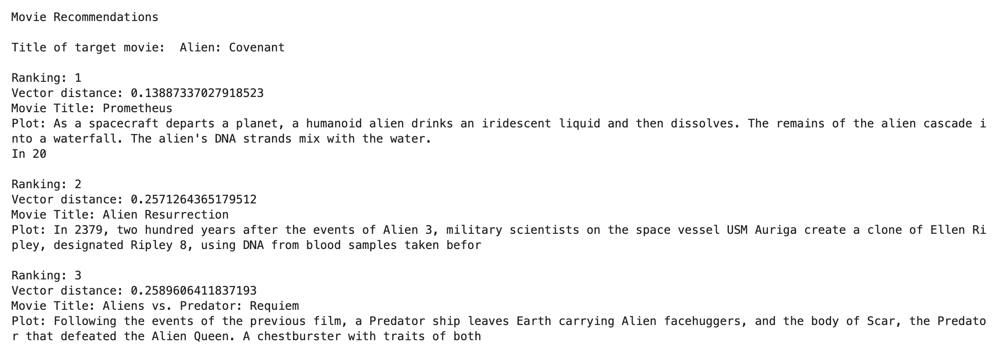
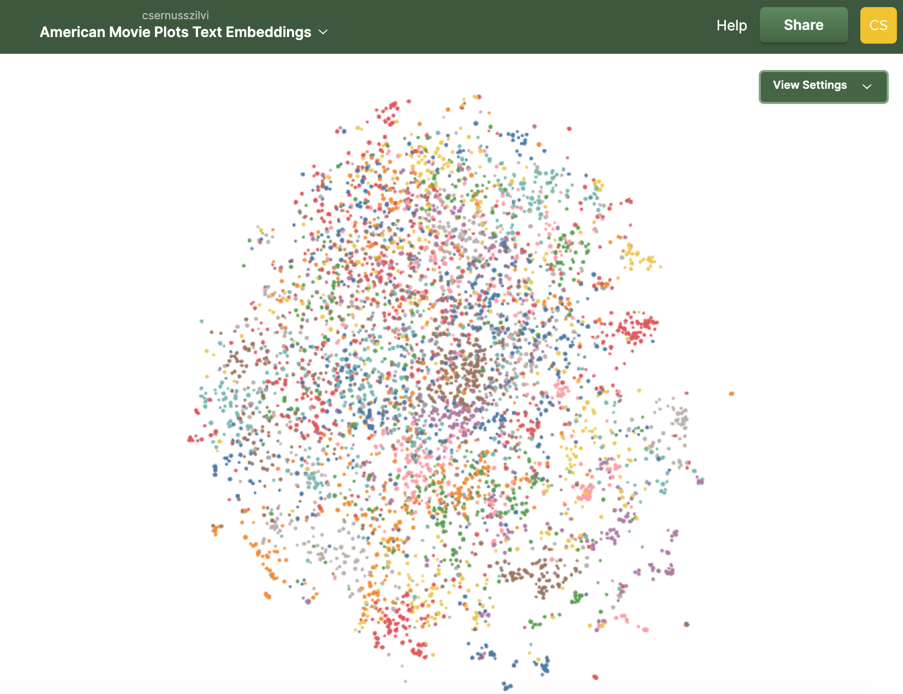

# Movie Recommendations with Embeddings

Recommends the k most similar movie(s) after their plot texts' similarities. 


5000 American movies are selected from a wiki dataset (see in [Credits](#credits)). For each movie plot, I created a text embedding with OpenAI's "text-embedding-3-small" model. 

Text embeddings measure the relatedness of text strings by turning the texts into high-dimentional vectors of floating point numbers. The distance between two vectors measures their relatedness:  small distances suggest high relatedness and large distances suggest low relatedness. 

To list movie recommendations for a selected movie, I selected the records with the smallest vector distances.



## NOMIC Atlas Map Visuals

By visualising the high-dimensional text embeddings in a 2D map with the help of NOMIC Atlas, we can see distinguishable clusters.



https://atlas.nomic.ai/data/csernusszilvi/experimental-arora/map


## How to run this project?


0. Prerequisites: 

    - Make sure Python3 is installed.
    - If you don't have an account with OpenAI, create one here: https://openai.com/
    - Create a project API key under Dashboard / API keys
    - Create a NOMIC Atlas account here: https://atlas.nomic.ai/

1. Clone the project. - Be aware that the project includes the cached, movie_embeddings.pkl file which is 86MB in size. This file helps avoid charges from OpenAI if you choose to run the embedding function with the same parameters as in the project. If you plan to use the embedding function for a different dataset / model, downloading this file won't be neccessary.

2. Create a virtual environment inside the project folder:

    `python -m venv venv`

3. Activate the virtual environment:


    Mac: `source venv/bin/activate`


    Windows: `venv\Scripts\activate`


4. Create an `.env` file in the root folder and add your project's API key:

    ```
    OPENAI_API_KEY=your-unique-opanai-project-key
    ```


5. Install the python dependencies:

    `pip install -r requirements.txt`


6. Log in into `NOMIC Atlas`

    - In the terminal: run `nomic login`, 
    - click the link to retrieve your API KEY then return to the terminal to run `nomic login <your-api-key>` to get authenticated.


7. Run the Jupyter Notebook:

    - `jupyter notebook` command will open the Notebook in the browser.
    - Run the commands in the given order in the `movies-embedding.ipynb` file, adjusting the models and cost calculations as neccessary. 
    - I used caching when I ran the embedding function myself. The cached pickle file, `movie_embeddings.pkl` is part of this project folder. If you don't change the dataset or the text-embedding model, you won't be charged as the embedding function will use the
    cached data whenever it's available.
    - Be aware that you'll be charged by OpenAI for running the embedding function if you use a different dataset and / or embedding model.


## Credits

- This project was adopted from Colt Steele's Walkthrough project on Udemy: [Mastering OpenAI Python APIs](https://www.udemy.com/course/mastering-openai/?couponCode=24T3MT53024).

    Changes made: My code and logic are significantly different from Colt's version, I used updated APIs and made improvements to the code's logic.

- Original dataset: https://www.kaggle.com/datasets/jrobischon/wikipedia-movie-plots?resource=download
